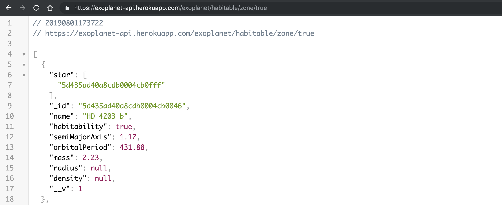
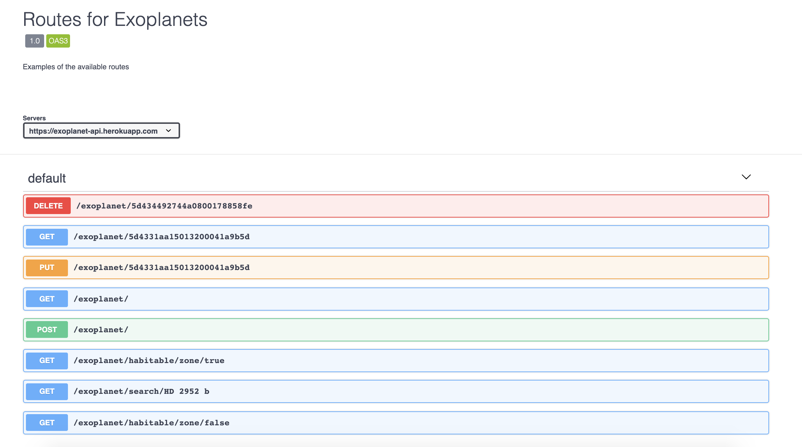
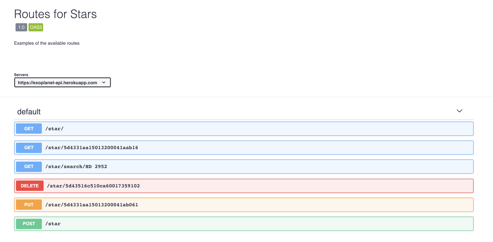

# Exoplanet-API

This is an API of exoplanets and their host stars using the open-source Confirmed Planets data provided by the NASA Exoplanet Science Institute (https://exoplanetarchive.ipac.caltech.edu/index.html).

In this API, the exoplanets include a new property called "habitability", a boolean representing whether or not the exoplanet is in the habitability zone of its host star. The determination of this value was calculated using equations provided by the NASA Exoplanet Science Institute (https://exoplanetarchive.ipac.caltech.edu/docs/poet_calculations.html).

  

  

## API Usage

Here are examples of the different methods available for interacting with the API. Search capabilities include entire collections, ID, Name, and habitability.

  

(https://app.swaggerhub.com/apis-docs/astnrgn/Exoplanet-API/1.0)

  

(https://app.swaggerhub.com/apis-docs/astnrgn/Exoplanet-API-2/1.0)

  

## Units of Measurement

### Exoplanets

|   Property    |  Unit   |
| :-----------: | :-----: |
| semiMajorAxis |   AU    |
| orbitalPeriod |  days   |
|     mass      | Jupiter |
|    radius     | Jupiter |
|    density    | g/cm^3  |

  

### Stars

| Property | Unit  |
| :------: | :---: |
|   mass   | Solar |
| effTemp  |   K   |
|  radius  | Solar |

  

## Installing

- Fork this repository

- Clone the forked version to your local repository

- npm install to add dependencies

- Open your cloned repository in your favorite text editor

- Have Fun!

  

## Built and Deployed With

- [JavaScript](https://www.javascript.com/)
- [Node.js](https://nodejs.org/)
- [Mongoose](https://mongoosejs.com/)
- [Express](https://expressjs.com/)
- [MongoDB & MongoDB Atlas](https://www.mongodb.com/)
- [Heroku](https://www.heroku.com/)

  

## Versioning

Version 1.0.0

  

## Authors

- **Austin Regan** - _Initial work_ - [GitHub Profile](https://github.com/astnrgn)
